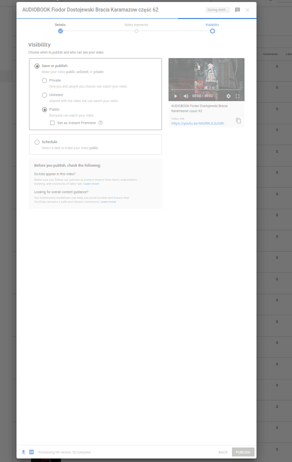

# youtube-publish-drafts

## help
to get help join our discord server https://discord.gg/xj6JxW8k

## support development of this project
```
BTC: bc1qksrtrwkhq043h56rsh9d4zdnmk0d43tm4m6xux
```

## about
Publish all your draft videos without clicking by using javascript


## how it would be used
if you were to do that, (which I'm pretty sure is against YouTube's terms of use, so don't do that), you'd:
1. go to YouTube Studio's "Content"  page
2. press f12
3. paste the entire content of youtube-publish-drafts.js file
4. wait

It should work as of 26.12.2020.
